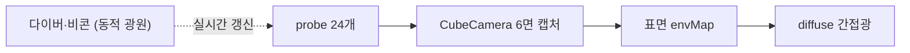

# Abyss — DDGI Light Diver

> 빛이 닿지 않는 심해 동굴을 탐험하는 발광 다이버 게임.
> **당신 자신이 유일한 빛**이며, 움직일 때마다 주변에 빛이 실시간으로 번진다.


-2ea44f)


컴퓨터 그래픽스 최종 과제 · **Three.js r182 (WebGPU)** 위에 **DDGI(Dynamic Diffuse Global Illumination)** 를 직접 구현.

| | |
| **플레이** | https://&lt;내아이디&gt;.github.io/abyss/ |
| **리포트** | [report.md](./report.md) |

---

## 특징

- **실시간 전역 조명(DDGI)** — 24개 irradiance probe가 동굴의 빛을 캡처해 간접광·color bleeding을 만든다
- **플레이어가 곧 광원** — 다이버가 움직이면 probe가 실시간 갱신되어 빛이 따라온다 (DDGI의 "Dynamic")
- **GI = 게임 메커닉** — 어둠 속 비콘을 빛으로 찾아 점등하는 탐색 루프. GI가 장식이 아니라 플레이의 근간
- **완결된 게임 루프** — 시작 → 구역 A 점등 → 출입구 개방 → 구역 B → 클리어
- **무빌드 단일 파일** — three.js를 CDN으로 로드, `index.html` 하나로 GitHub Pages에 바로 배포

## 조작

| 키 | 동작 | | 키 | 동작 |
|---|---|---|---|---|
| `WASD` | 이동 | | `G` | GI on/off |
| `Space` / `C` | 상승 / 하강 | | `P` | probe 시각화 |
| `마우스` | 시점 | | `H` | HUD 숨김 |

## 구현 하이라이트



- **probe field** — `WebGLCubeRenderTarget` + `CubeCamera`로 각 지점의 사방 빛을 큐브맵 캡처 (레이트레이싱을 래스터화로 치환)
- **표면 샘플링** — 벽·바닥을 타일로 나눠 타일마다 가장 가까운 probe의 간접광을 받음
- **동적 GI** — 점등된 비콘이 emissive 광원이 되어 GI에 기여, multi-bounce가 emergent하게 발생
- **성능** — 로딩 중 probe 워밍업 + 가까운 probe 위주의 amortized 갱신

## 파일 구성

```
abyss/
├─ index.html      # 게임 본체 (단일 파일)
├─ report.md       # 과제 리포트 (구현 상세 + 강의 매핑 + 다이어그램)
├─ README.md       # 이 문서
└─ screenshots/    # 리포트용 게임 캡처
```

## 로컬 실행

```bash
# 폴더에서
python3 -m http.server 8000
# 브라우저: http://localhost:8000
```

최신 **Chrome / Edge**(WebGPU) 권장. 미지원 시 WebGL2로 자동 폴백.
