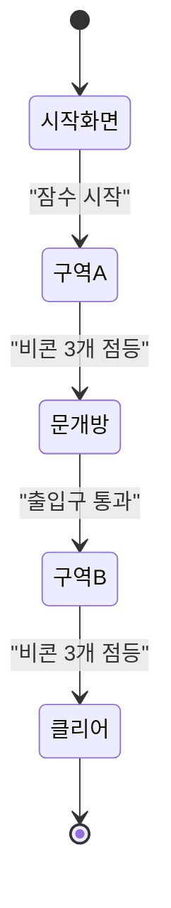
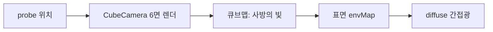
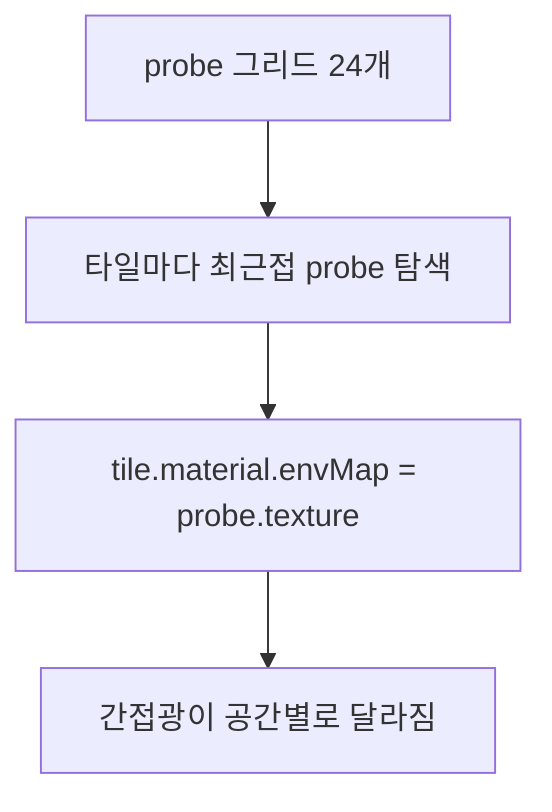
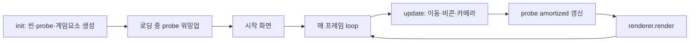

# Abyss — DDGI Light Diver · 최종 과제 리포트

> 컴퓨터 그래픽스 최종 과제
> 게임 링크: `https://<내아이디>.github.io/abyss/`
> 기술 스택: **Three.js r182 (WebGPU)** · GI 기법: **DDGI (Dynamic Diffuse Global Illumination)**

> **제출 전 촬영 체크리스트** (아래 임베드된 이미지는 모두 본인 게임에서 캡처해 `screenshots/`에 넣을 것. `H`로 HUD를 숨기고 촬영):
> `01_title` · `02_overview` · `10_gi_on` / `11_gi_off`(G 토글, 카메라 고정) · `probe_grid`(P)
> 본인 게임 캡처가 없는 항목은 0점 처리됨. 본 리포트의 다이어그램은 캡처를 **보조**하는 용도다.

---

## 1. 게임 개요 (기획)

### 1.1 콘셉트
빛이 닿지 않는 심해 동굴을 탐험하는 발광 다이버. **플레이어 자신이 유일한 동적 광원**이며, 움직일 때마다 주변 컬러 산호·암벽에 빛이 실시간으로 번진다(간접광). 어둠 속에 잠든 **비콘 6개**를 빛으로 찾아 점등하고 동굴을 빠져나가는 것이 목표다.

### 1.2 설계 철학 — "GI를 장식이 아닌 메커닉으로"
대부분의 실시간 GI 데모는 밝은 컬러 박스(코넬 박스 변형) 안에서 GI를 *효과*로만 보여준다. 본 작품의 핵심 설계 의도는 GI를 **게임의 근간**으로 끌어들이는 것이다:

- **어둠 속 탐색 = GI**: 직접광이 닿지 않는 구석을 간접광이 채워야 비콘이 보인다. 즉 GI가 곧 탐색 수단이다.
- **플레이어 = 동적 광원**: 다이버가 움직이면 광원이 함께 움직여 probe들이 실시간 갱신된다. DDGI의 "Dynamic"이 게임플레이로 직결된다.
- **비콘 점등 = 새 광원 생성**: 켜진 비콘은 스스로 빛을 내 GI에 기여한다. 진행할수록 공간이 밝아진다.

이 결합 덕분에 *기획*과 *GI 기술* 점수가 같은 시스템에서 동시에 증명된다.


### 1.3 코어 게임플레이 루프



어둠 진입 → 내 빛으로 주변을 드러냄 → 간접광으로 비콘 발견 → 근접 점등 → 구역 A의 비콘 3개로 출입구 개방 → 구역 B로 건너가 나머지 점등 → 탈출.

### 1.4 조작
이동 `WASD` · 상승/하강 `Space`/`C` · 시점 `마우스`. 디버그: `G` GI on/off · `P` probe 시각화 · `H` HUD.

---

## 2. 강의 내용 ↔ 구현 매핑

> "강의 주제"는 예시. **실제 수업 목차의 항목명으로 교체**할 것.

| 강의 주제(예시) | 구현에서의 대응 | 핵심 함수/변수 | 절 |
|---|---|---|---|
| Global Illumination 개념 | DDGI 간접광(envMap 기반 diffuse IBL) | `giMat`, `envMapIntensity` | 3.1 |
| Irradiance probe / light field | 24개(6×2×2) probe 격자 캡처 | `buildProbeGrid`, `CubeCamera` | 3.2 |
| 렌더링 방정식 / diffuse irradiance | probe 큐브맵 → 표면 간접광 | `assignAllProbes`, `envMap` | 3.2 |
| 텍스처 / 큐브맵 매핑 | `WebGLCubeRenderTarget`로 6면 캡처 | `buildProbeGrid` | 3.2 |
| PBR / 직접광 라이팅 | 다이버 PointLight + MeshStandardMaterial | `buildDiver`, `diverLight` | 4.2 |
| 동적 광원 / 실시간 갱신 | 플레이어·비콘이 probe를 실시간 갱신 | `updateProbes`, `lightBeacon` | 3.6 |
| 실시간 성능 최적화 | amortized 갱신 + 워밍업 | `updateProbes`, `warmup` | 3.5 |
| 톤매핑 / 포스트프로세싱 | ACESFilmic + FogExp2 | `init` | 4.1 |

---

## 3. GI 기술 적용 상세 (DDGI)

### 3.1 웹에서의 DDGI 전략 — 큐브맵이 레이트레이싱을 대체

**원리(강의)**: 전역 조명은 한 점에 도달하는 모든 방향의 입사광을 적분해 간접광을 구한다. 정통 DDGI는 각 probe에서 광선을 쏴(ray-traced irradiance field) 이 입사광을 수집한다.

**구현**: WebGPU에는 하드웨어 레이트레이싱이 없으므로, 본 구현은 입사광 수집을 **큐브맵 래스터화**로 치환했다. probe 위치에 `CubeCamera`를 두고 씬을 6면 렌더링하면 "그 지점에서 사방으로 본 빛"이 큐브 텍스처에 담기는데, 이는 모든 방향의 입사광을 모은 것과 동일한 정보다.



DDGI를 정의하는 구조 — **probe field, 표면의 probe 샘플링, 동적 갱신** — 은 그대로 유지된다.

### 3.2 Probe 그리드와 표면 샘플링

**원리(강의)**: irradiance probe field는 공간에 probe를 격자로 깔고, 임의의 표면이 주변 probe의 irradiance를 보간해 간접광을 얻는 기법이다.

**구현**: 동굴에 **24개(6×2×2)**의 probe를 배치했다. 각 probe는 `WebGLCubeRenderTarget`(32px, HalfFloat — HDR 발광 보존) + `CubeCamera` 쌍이다.

```javascript
for (const x of PX) for (const y of PY) for (const z of PZ) {
  const rt = new THREE.WebGLCubeRenderTarget(PROBE_RES, { type: THREE.HalfFloatType });
  const cam = new THREE.CubeCamera(0.3, 60, rt);
  cam.position.set(x, y, z);
  probes.push({ pos: cam.position.clone(), rt, cam });
}
```

벽·바닥·천장은 큰 면 하나가 아니라 **작은 타일로 분할**(`tiled()`)하고, 각 타일이 자신과 **가장 가까운 probe의 큐브 텍스처를 `envMap`으로** 받는다.

```javascript
function assignAllProbes() {
  giMeshes.forEach((mesh) => {
    mesh.getWorldPosition(wp);
    let best, bestD = Infinity;
    for (const p of probes) {                 // 가장 가까운 probe 선택
      const d = p.pos.distanceToSquared(wp);
      if (d < bestD) { bestD = d; best = p; }
    }
    mesh.material.envMap = best.rt.texture;    // 그 probe의 간접광을 받음
  });
}
```



**결과**: 간접광이 공간에 따라 달라지고 다이버를 따라 움직인다.

> **설계 판단**: 픽셀마다 주변 8개 probe를 블렌딩하려면 다수의 큐브맵을 셰이더에서 동적 인덱싱해야 하나 GPU에서 불가능하다(정통 DDGI가 octahedral atlas로 푸는 이유). 본 구현은 커스텀 셰이더 없이 안정적으로 가기 위해 **probe 선택 단위를 픽셀이 아닌 타일로** 두었다. 면을 잘게 나눈 만큼 공간 해상도가 확보된다. (한계와 확장 방향은 6장 참조)

### 3.3 GI ON / OFF 비교 (핵심 증명)

| GI ON | GI OFF |
|---|---|
|  |  |

GI ON에서는 산호·비콘의 색이 주변 표면으로 번지고(color bleeding) 그늘이 채워진다. OFF(`G` 키, 모든 GI 머티리얼의 `envMapIntensity`를 0으로)에서는 다이버의 직접광만 남아 주변이 어둡게 떨어진다. 이 비교가 간접광이 실제로 기여함을 직접 보여준다.

### 3.4 Probe 시각화

`P` 키로 각 probe가 캡처한 환경을 거울 구체(metalness=1)로 표시한다. 다이버 근처 probe일수록 밝은 빛을 담고 있어 probe field의 동작을 눈으로 확인할 수 있다.


### 3.5 성능: 워밍업 + amortized 갱신

**문제**: 24개 probe × 6면을 매 프레임 갱신하면 비용이 크다.

**해결 1 — 워밍업**: 시작 시 모든 probe를 로딩 화면 뒤에서 프레임당 소수씩 미리 채워, 플레이 시작 시의 끊김과 셰이더 첫 컴파일 부하를 로딩 구간으로 옮긴다.

**해결 2 — amortized 갱신**: 플레이 중엔 **다이버에 가까운 2개 + 라운드로빈 1개**만, 그것도 **4프레임에 1회** 갱신한다. 가까운 probe(빛이 실제 닿는 곳)는 최신을 유지하고 먼 probe는 순회 갱신되어 잔상을 막는다.

```javascript
// 거리순 정렬 후 가까운 것 + 라운드로빈 1개만 갱신
const order = probes.map((p,i)=>({i, d:p.pos.distanceToSquared(diverPos)}))
                    .sort((a,b)=>a.d-b.d);
for (let k=0; k<UPDATE_NEAR; k++) set.add(order[k].i);
set.add(rrCursor++ % probes.length);
set.forEach((i)=>probes[i].cam.update(renderer, scene));
```

HUD의 FPS로 실시간 예산을 확인할 수 있다.

### 3.6 동적 GI (플레이어·비콘 = 광원)

**원리(강의)**: DDGI의 강점은 광원이 움직여도 probe가 매 프레임 갱신되어 간접광이 따라온다는 점(정적 라이트맵 대비).

**구현**: 발광 산호와 **점등된 비콘은 emissive**라서, probe가 씬을 캡처할 때 자동으로 광원으로 잡힌다. 따라서 비콘을 켜면(`lightBeacon`) 그 빛이 다음 probe 갱신에서 주변 벽에 번지는 동적 GI가 발생한다. 또한 직전 프레임의 envMap을 가진 벽이 다시 캡처되며 **다중 바운스**가 emergent하게 나타난다. 다이버의 `PointLight`가 움직이면 인근 probe들이 그에 맞춰 갱신되어, "플레이어가 곧 동적 광원"이라는 콘셉트가 GI 시스템과 직접 결합된다.

<!-- 선택 캡처: 비콘 점등 전/후로 주변 벽이 밝아지는 비교를 찍으면 동적 GI를 더 잘 보여줄 수 있음


-->

---

## 4. 개발 상세 (완성도)

### 4.1 전체 파이프라인

단일 `index.html`. `importmap`으로 Three.js r182 `three/webgpu`를 CDN 로드 → 별도 빌드 없이 GitHub Pages 배포. `WebGPURenderer` 생성 후 `await renderer.init()`(WebGPU 비동기 초기화) → `setAnimationLoop`.



톤매핑 ACESFilmic, 안개 FogExp2로 심해 분위기를 냈다.

### 4.2 다이버와 카메라

다이버는 `Group`(발광 본체 + 밝은 코어 + 방향 지느러미 + `PointLight`)으로, PointLight가 직접광이자 GI를 구동하는 동적 광원이다. 카메라는 **3인칭 스프링암**: 다이버 뒤로 목표 거리를 잡되 카메라→다이버 레이캐스트로 벽에 막히면 당겨와 관통을 막는다.

```javascript
raycaster.set(target, dir); raycaster.far = dist;
const hits = raycaster.intersectObjects(wallMeshes, false);
if (hits.length > 0)                       // 벽에 막히면 그만큼 당겨옴
  desired = target.clone().add(dir.clone().multiplyScalar(hits[0].distance - 0.4));
camera.position.lerp(desired, 1 - Math.pow(0.0015, dt));   // 부드러운 추적
```

이동은 카메라 yaw 기준, 충돌은 챔버 경계 클램프 + 칸막이 통과 차단으로 처리했다.

### 4.3 게임 루프 (비콘·문·승리)

비콘 6개(A 3 + B 3). 매 프레임 다이버와의 거리를 재 반경(`ACTIVATE_R`) 안에 들어오면 `charge`가 차오르고, 다 차면 점등되어 밝은 emissive + 자체 `PointLight`(=새 GI 광원)가 된다.

```javascript
if (d < ACTIVATE_R) {
  b.charge += dt / CHARGE_TIME;
  b.mat.emissiveIntensity = 0.18 + b.charge * 3.4;   // 충전될수록 밝아짐
  if (b.charge >= 1) lightBeacon(b);
}
```

구역 A 3개 점등 시 출입구 에너지막(반투명 평면)이 서서히 사라지며 통로가 열리고, 총 6개 점등 시 클리어 화면(소요 시간 표시). 시작 → 플레이 → 클리어로 완결된 루프다.

### 4.4 겪은 문제와 해결

- **`CubeRenderTarget is not a constructor`**: r182 `three/webgpu`에서 미노출 → `WebGLCubeRenderTarget`로 교체(WebGPU 렌더러에서 정상 동작).
- **초반 멈춤("응답 없음")**: 시작 시 모든 probe를 동기로 렌더해 메인 스레드가 장시간 블로킹됨 → 워밍업을 **프레임당 소수로 분산**하고 로딩 화면 뒤에서 완료하도록 변경.
- **상시 렉**: probe 갱신마다 다수 타일을 6면 렌더 → probe 수(48→24)·타일 수·해상도(48→32px)·갱신 빈도를 낮춰 부하를 크게 감소.
- **가시성(light leak 방지) 범위 결정**: line-of-sight 기반 가시성을 시험했으나 단일 동굴 구조에서는 차이가 미미해, 안정성과 명료성을 위해 제외하고 **octahedral atlas 기반 Chebyshev 가시성을 향후 확장으로** 남겼다(6장).

---

## 5. 채점 기준 대응
| 항목(배점) | 대응 |
|---|---|
| 기획 (20) | GI가 콘셉트·메커닉(탐색)과 직결된 완결형 설계 |
| 완성도 (20) | 시작→플레이→클리어 루프 + 진행 게이팅(문) 완비 |
| GI 기술 (20) | DDGI probe field + 동적 갱신, GI/probe 토글로 증빙 |
| 리포트 (40) | 강의↔구현 매핑 + 코드·다이어그램 + 본인 게임 캡처 |

---

## 6. 한계와 향후 계획
- **Octahedral atlas DDGI**: 모든 probe를 단일 2D atlas에 인코딩하면 픽셀 단위 8-probe 트라이리니어 블렌딩 + Chebyshev 가시성(light leak 방지)이 가능해져 타일 경계 seam이 사라진다. 본 구현은 안정성을 위해 타일 단위로 단순화했으며, 이것이 가장 우선되는 확장 방향이다.
- **트레이스드 DDGI**: 큐브맵 게더를 WebGPU compute의 SDF 레이마칭으로 교체하면 정통 DDGI에 근접한다.

---

## 7. 빌드 / 실행
- 웹: `https://<내아이디>.github.io/abyss/`
- 로컬: 폴더에서 `python3 -m http.server 8000` → `http://localhost:8000`
- 권장: 최신 Chrome / Edge (WebGPU 지원, 미지원 시 WebGL2 폴백)

## 8. 회고
DDGI의 정통 구현은 octahedral atlas와 가시성 테스트까지 포함하지만, WebGPU·시간·검증 가능성의 제약 안에서 **무엇을 단순화하고 무엇을 지킬지** 판단하는 과정 자체가 큰 학습이었다. 큐브맵으로 레이게더를 치환하면서도 probe field·동적 갱신이라는 DDGI의 본질은 유지했고, 그 한계와 확장 방향을 명확히 인지하게 되었다. `<직접 느낀 점을 한두 문장 추가>`
