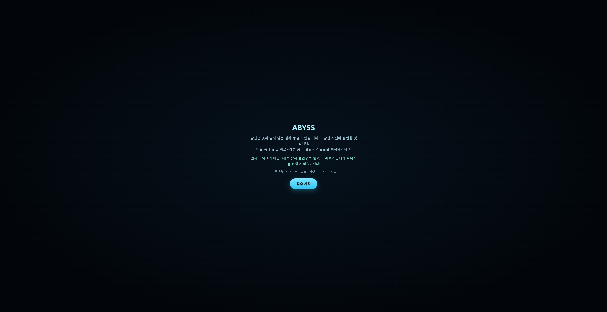
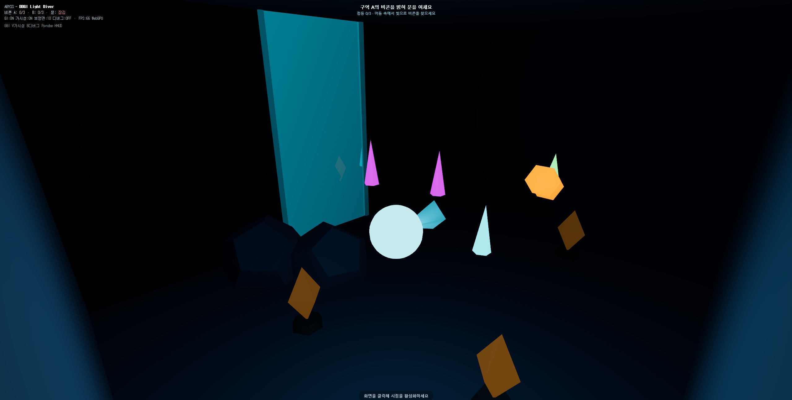
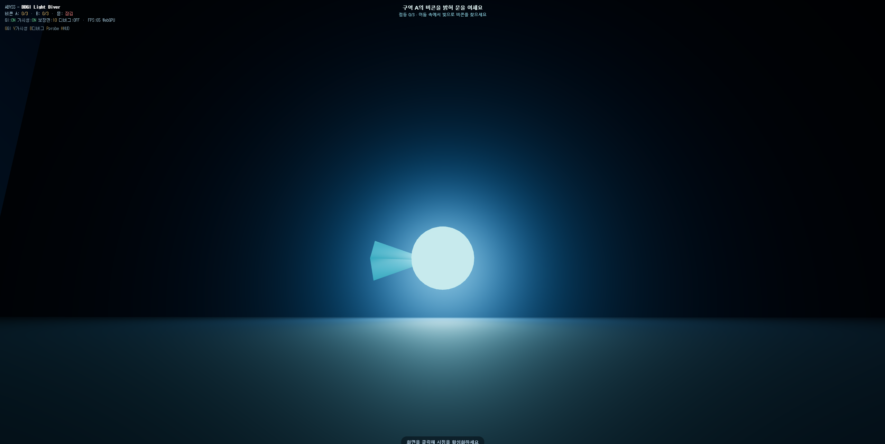
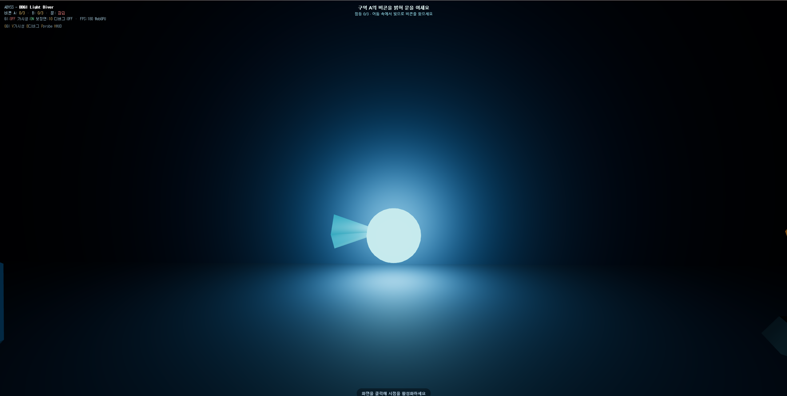
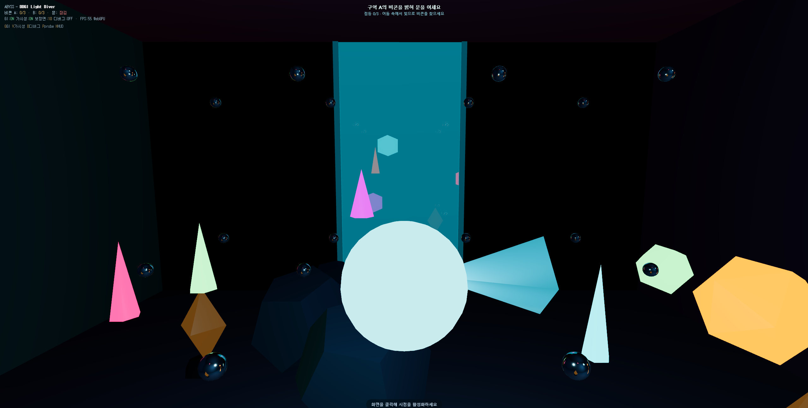

# Abyss — DDGI Light Diver · 최종 과제 리포트

> 컴퓨터 그래픽스 최종 과제
> 게임 링크: `https://<내아이디>.github.io/abyss/`
> 기술 스택: **Three.js r182 (WebGPU)** · GI 기법: **DDGI (Dynamic Diffuse Global Illumination)**

> 📷 **제출 전 촬영 체크리스트** (아래 임베드된 이미지는 모두 본인 게임에서 캡처해 `screenshots/`에 넣을 것. `H`로 HUD를 숨기고 촬영):
> `01_title` · `02_overview` · `10_gi_on` / `11_gi_off`(G 토글, 카메라 고정) · `probe_grid`(P) · `leak_debug`(B) · `vis_off` / `vis_on`(V 토글)
> ⚠️ 본인 게임 캡처가 없는 항목은 0점 처리됨.

---

## 1. 게임 개요 (기획)

### 1.1 콘셉트
빛이 닿지 않는 심해 동굴을 탐험하는 발광 다이버. **플레이어 자신이 유일한 동적 광원**이며, 움직일 때마다 주변 컬러 산호·암벽에 빛이 실시간으로 번진다(간접광). 어둠 속에 잠든 **비콘 6개**를 빛으로 찾아 점등하고 동굴을 빠져나가는 것이 목표다.

이 작품의 핵심 설계 의도는 **GI를 장식이 아니라 게임의 근간으로 삼은 것**이다. 대부분의 실시간 GI 데모가 밝은 컬러 박스 형태로 수렴하는 데 비해, 본 작품은 "어둠 + 플레이어가 곧 광원" 구도를 택해 DDGI의 핵심 강점인 **실시간 동적 간접광**이 탐색 그 자체가 되도록 했다.

### 1.2 코어 게임플레이 루프
어둠 진입 → 내 빛으로 주변을 드러냄(직접광 + DDGI 간접광) → 간접광으로 비콘을 발견 → 근접해 점등 → 구역 A의 비콘 3개를 밝혀 출입구 개방 → 구역 B로 건너가 나머지 점등 → 탈출 성공.

### 1.3 조작
이동 `WASD` · 상승/하강 `Space`/`C` · 시점 `마우스`. 디버그: `G` GI · `V` 가시성 · `B` 빛샘 디버그 · `P` probe 시각화 · `H` HUD.

---

## 2. 강의 내용 ↔ 구현 매핑

> ⚠️ "강의 주제"는 예시. **실제 수업 목차의 항목명으로 교체**할 것.

| 강의 주제(예시) | 구현에서의 대응 | 절 | 상태 |
|---|---|---|---|
| Global Illumination 개념 | DDGI 간접광(envMap 기반 diffuse IBL) | 3.1 | ✅ |
| Irradiance probe / light field | 5×2×4 = 40개 probe 격자 캡처 | 3.2 | ✅ |
| 렌더링 방정식 / diffuse irradiance | probe 큐브맵 → 표면 간접광 | 3.2 | ✅ |
| 가시성 / light leak 방지 | line-of-sight 기반 probe 선택 | 3.6 | ✅ |
| PBR / 직접광 라이팅 | 다이버 PointLight + MeshStandardMaterial | 4.2 | ✅ |
| 동적 광원 / 실시간 갱신 | 플레이어·비콘이 probe를 실시간 갱신 | 3.7 | ✅ |
| 톤매핑 / 포스트프로세싱 | ACESFilmic + FogExp2 | 4.1 | ✅ |
| (심화) Octahedral 인코딩 | 향후 확장으로 기술 | 6 | 🔜 |

---

## 3. GI 기술 적용 상세 (DDGI)

### 3.1 웹에서의 DDGI 전략 — 큐브맵이 레이트레이싱을 대체
정통 DDGI는 각 probe에서 광선을 쏴 주변 라디언스를 모은다. WebGPU에는 하드웨어 레이트레이싱이 없으므로, 본 구현은 이를 **큐브맵 래스터화로 치환**했다. probe 위치에 `CubeCamera`를 두고 씬을 6면 렌더링하면 "그 지점에서 사방으로 본 빛"이 큐브 텍스처에 담기며, 이는 광선을 쏜 것과 동일한 정보다. DDGI를 정의하는 구조 — **probe field, 표면의 probe 샘플링, 가시성** — 는 그대로 유지된다.

### 3.2 Probe 그리드와 표면 샘플링
동굴 전체에 **40개(5×2×4)의 irradiance probe**를 배치했다. 각 probe는 `WebGLCubeRenderTarget`(64px, HalfFloat) + `CubeCamera` 쌍이다. 벽·바닥·천장은 큰 면 하나가 아니라 **작은 타일로 분할**하고, 각 타일이 자신과 **가장 가까운 probe의 큐브 텍스처를 `envMap`으로** 받아 diffuse 간접광(IBL)을 계산한다. 그 결과 간접광이 공간에 따라 달라지고 다이버를 따라 움직인다.

> **설계 판단**: 픽셀마다 주변 8개 probe를 블렌딩하려면 다수의 큐브맵을 셰이더에서 동적 인덱싱해야 하는데 이는 GPU에서 불가능하다(정통 DDGI가 octahedral atlas로 푸는 이유). 본 구현은 커스텀 셰이더 없이 안정적으로 가기 위해 **probe 선택의 단위를 픽셀이 아닌 타일로** 두었다. 면을 잘게 나눈 만큼 공간 해상도가 확보된다.

### 3.3 GI ON / OFF 비교 (핵심 증명)
| GI ON | GI OFF |
|---|---|
|  |  |

GI ON에서는 산호·비콘의 색이 주변 표면으로 번지고(color bleeding) 그늘이 채워지지만, OFF(`G` 키, 모든 머티리얼의 `envMapIntensity`를 0으로)에서는 다이버의 직접광만 남아 주변이 어둡게 떨어진다.

### 3.4 Probe 시각화
`P` 키로 각 probe가 캡처한 환경을 거울 구체로 표시한다. 다이버 근처 probe일수록 밝은 빛을 담고 있어 probe field가 어떻게 동작하는지 확인할 수 있다.

### 3.5 성능: amortized 갱신
40개 probe(각 6면 렌더)를 매 프레임 갱신하면 비용이 크므로, **다이버에 가까운 4개 + 라운드로빈 1개**만 갱신한다. 가까운 probe는 최신을 유지하고 먼 probe는 순회 갱신되어 잔상을 막는다. HUD의 FPS로 실시간 예산을 확인할 수 있다.

### 3.6 가시성 / Light leak 방지
probe를 "가장 가까운 것"으로만 고르면 벽 너머 probe의 빛이 벽을 뚫고 새어 나온다(light leak). 이를 막기 위해 각 타일마다 후보 probe를 거리순으로 정렬하고, **타일→probe 사이를 레이캐스트하여 차폐물(칸막이)에 막히지 않은 가장 가까운 probe**를 선택한다. 이는 정통 DDGI의 Chebyshev depth 테스트와 **목적이 동일한** 가시성 처리를, 셰이더 대신 할당 시점의 line-of-sight로 구현한 것이다.

검증을 위해 두 결과(`naive`=가장 가까운 / `visible`=시야 확보)를 모두 저장한다. `B` 키는 가시성이 교정한 면을 빨갛게 칠하고, HUD의 **"보정된 면: N개"**가 그 수를 보여준다. `V` 키로 두 결과를 스왑해 빛샘을 직접 비교할 수 있다.

| 가시성 OFF (빛샘) | 가시성 ON (교정) |
|---|---|
|  |  |

### 3.7 동적 GI (플레이어·비콘 = 광원)
발광 산호와 **점등된 비콘은 emissive**라서, probe가 씬을 캡처할 때 자동으로 광원으로 잡힌다. 따라서 비콘을 켜면 그 빛이 다음 probe 갱신에서 주변 벽에 번지는 **동적 GI**가 발생한다. 또한 직전 프레임의 envMap을 가진 벽이 다시 캡처되며 **다중 바운스**가 은근히 emergent하게 나타난다. 다이버의 `PointLight`가 움직이면 probe들이 그에 맞춰 갱신되어, "플레이어가 곧 동적 광원"이라는 콘셉트가 GI 시스템과 직접 결합된다.

<!-- 선택 캡처: 비콘 점등 전/후로 주변 벽이 밝아지는 비교를 찍으면 동적 GI를 더 잘 보여줄 수 있음

-->

---

## 4. 개발 상세 (완성도)

### 4.1 전체 파이프라인
단일 `index.html`. `importmap`으로 Three.js r182 `three/webgpu`를 CDN 로드 → 별도 빌드 없이 GitHub Pages 배포. `WebGPURenderer` 생성 후 `await renderer.init()`(WebGPU 비동기 초기화) → `setAnimationLoop`. 매 프레임 ① `update(dt)`(게임·이동·카메라) → ② `updateProbes()`(GI 일부 갱신) → ③ `render`. 톤매핑 ACESFilmic, 안개 FogExp2.

### 4.2 다이버와 카메라
다이버는 `Group`(발광 본체 + 밝은 코어 + 방향 지느러미 + `PointLight`)으로, PointLight가 직접광이자 GI를 구동하는 동적 광원이다. 카메라는 **3인칭 스프링암**: 다이버 뒤로 목표 거리를 잡되 카메라→다이버 레이캐스트로 벽에 막히면 당겨와 벽 관통을 막는다. 이동은 카메라 yaw 기준, 충돌은 챔버 경계 클램프 + 칸막이 통과 차단.

### 4.3 게임 루프 (비콘·문·승리)
비콘 6개(A 3 + B 3). 매 프레임 다이버와의 거리를 재 반경 안에 들어오면 `charge`가 차오르고, 다 차면 점등되어 밝은 emissive + 자체 `PointLight`(=새 GI 광원)가 된다. A 3개 점등 시 출입구 에너지막(반투명 평면)이 사라지며 통로가 열리고, 총 6개 점등 시 클리어 화면(소요 시간 표시). 시작 화면 → 플레이 → 클리어로 완결된 루프.

### 4.4 겪은 문제와 해결
- **`CubeRenderTarget is not a constructor`**: r182 `three/webgpu`에서 미노출 → `WebGLCubeRenderTarget`로 교체(WebGPU 렌더러에서 정상 동작).
- `<여기에 개발 중 겪은 다른 문제를 추가>`

---

## 5. 채점 기준 대응
| 항목(배점) | 대응 |
|---|---|
| 기획 (20) | GI가 콘셉트·메커닉(탐색)과 직결된 완결형 설계 |
| 완성도 (20) | 시작→플레이→클리어 루프 + 진행 게이팅(문) 완비 |
| GI 기술 (20) | DDGI probe field + 가시성 + 동적 갱신, 토글로 증빙 |
| 리포트 (40) | 강의↔구현 매핑 + 모든 항목 본인 게임 캡처 |

---

## 6. 한계와 향후 계획
- **Octahedral atlas DDGI**: 모든 probe를 단일 2D atlas에 인코딩하면 픽셀 단위 8-probe 블렌딩 + Chebyshev 가시성이 가능해져 타일 경계 seam이 사라진다. 본 구현은 안정성을 위해 타일 단위로 단순화했으며, 이것이 다음 확장 방향이다.
- **트레이스드 DDGI**: 큐브맵 게더를 WebGPU compute의 SDF 레이마칭으로 교체하면 정통 DDGI에 근접한다.

---

## 7. 빌드 / 실행
- 웹: `https://<내아이디>.github.io/abyss/`
- 로컬: 폴더에서 `python3 -m http.server 8000` → `http://localhost:8000`
- 권장: 최신 Chrome / Edge (WebGPU)

## 8. 회고 (작성 예정)
`<배운 점, 한계, 더 해보고 싶은 것>`
